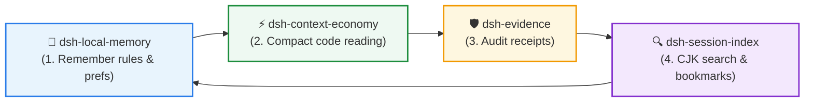

<div align="center">

# 🔍 dsh-session-index

**Full-text session search & bookmarking engine for DSH**  
*CJK Substring Search • Worker-Based Indexing • Multi-Signal Ranking • Stable Message Anchors*

[](https://github.com/huangjua)
[](#)
[](LICENSE)

[Features](#-why-dsh-session-index) • [Quick Start](#-quick-start) • [DSH Power Suite](#-dsh-power-suite) • [Reference](#-deep-dive--reference) • [简体中文](README_zh.md)

</div>

---

### 💡 Why dsh-session-index?

DSH stores durable conversation history as compressed `.jsonl.zstd` event logs. This plugin builds separate metadata and full-text indexes so historical Chinese phrases and code fragments can be searched without modifying those logs.

- 🇨🇳 **CJK & Latin substring search**: FTS5 trigrams provide candidates; complete original-message text verifies matches. Short terms use a LIKE path.
- 🚀 **Worker-based indexing**: Parser workers stream decompression; separate SQLite writer and WAL reader processes keep synchronous SQL out of the host event loop. Measurements and resource limits are described below.
- 🎯 **Multi-signal relevance ranking**: Combines `fzy` fuzzy scoring, 21-day half-life recency decay and workspace affinity, drawing on Atuin and McFly.
- 🔖 **Stable message bookmarks**: New bookmarks use `(sessionId, anchorId)`. Rebuilds preserve anchors within the supported identity contract; missing or replaced anchors return an explicit failure.

---

## 🚀 Quick Start

### Installation and deployment

The package entrypoint is `lib/index.js`. DSH installs it as a bundle through `package.json`'s `dsh.bundle.patch` and `cordis.patch.yml`, selected by the profile's `dsh.profile.bundles` or through DSH's `dsh plugin add` flow. Compile the complete `lib/`, including worker modules, before loading it.

This checkout's **`0.0.3-rc.2` is the isolated runtime repair candidate**, with artifacts in `release/RUNTIME-20261002/`. See [RUNTIME_FIX_REPORT.txt](RUNTIME_FIX_REPORT.txt) and [DEPLOYMENT_AND_ROLLBACK.txt](DEPLOYMENT_AND_ROLLBACK.txt) for validation and deployment steps. Production deployment requires separate authorization. Build in the isolated E-drive workspace; the deployed G-drive source is older than its runtime and must not be built. The candidate's root `cordis.patch.yml` is portable and must not replace the user's existing configuration.

### Typical usage

Tool-call notation is illustrative; use the exact session/anchor pair returned by a content search.

```text
session_index_search query="重构 认证中间件" mode="full"
session_summary id="session-xxxx"
session_index_bookmark action="add" sessionId="session-xxxx" anchorId="a1:..." label="JWT Auth Fix"
session_index_bookmark action="list" query="JWT"
session_index_search session_id="session-xxxx" anchor_id="a1:..." window=5
```

`session_summary` takes **`id`**, bookmark add takes **`sessionId`** and **`anchorId`**, and SCROLL takes **`session_id`** and **`anchor_id`**. Omitting the message anchor creates a session-level bookmark. Metadata-only hits have no message anchor.

---

## 🧩 DSH Power Suite

This plugin is part of the **DSH Agent Power Suite**, four modular plugins with no hard dependencies on one another:



| Plugin | Role | Synergy with Session Index |
|---|---|---|
| 🔍 **[dsh-session-index](https://github.com/huangjua/dsh-session-index)** | Session search | Searches compressed archives and stores bookmarks. |
| 🧠 **[dsh-local-memory](https://github.com/huangjua/dsh-local-memory)** | Memory layer | Curates high-level memories; this plugin retrieves original logs. |
| 🛡️ **[dsh-evidence](https://github.com/huangjua/dsh-evidence)** | Audit & receipts | Session search helps locate prior evidence bundles and audit conclusions. |
| ⚡ **[dsh-context-economy](https://github.com/huangjua/dsh-context-economy)** | Context economy | Compact pointer output can reduce log volume and indexing work. |

---

## 📖 Deep Dive & Reference

<details>
<summary><b>🛠️ Available tools (5)</b></summary>

| Tool | Description |
|---|---|
| `session_index_status` | Inspect/refresh metadata and FTS state, parsed versus committed checkpoints, scan completeness, worker health and retention. |
| `session_index_list` | List sessions by workspace with stable cursor pagination or relevance sorting. |
| `session_index_search` | Search metadata (`mode=meta`, default) or content (`mode=full`); SCROLL reads context around an exact session/message anchor. |
| `session_summary` | Deterministic fields, timestamps, event counts and tool counts; optionally a cached LLM one-liner. Required parameter: `id`. |
| `session_index_bookmark` | Add/list/remove bookmarks; `add` requires `sessionId`, and message bookmarks use `anchorId`. |

Optional LLM summaries are controlled by `llmSummaryEnabled` (default `true`), run only on the summary path and fall back to deterministic output when unavailable. Set it to `false` to disable provider calls and summary-cache access.

</details>

<details>
<summary><b>🔎 Content coverage and filters</b></summary>

`mode=full` searches user/assistant text and `tool/call` names after supported surface-replacement rules are applied. It excludes system/developer messages, tool-result bodies, tool arguments and non-text content. A tool-role match identifies a tool name, not its output. Without a specific message role, full searches may also contain metadata-only hits; their `kind=meta` entries have no anchor.

FTS preserves complete original-message text within a per-source **50,000-message / 64 MiB UTF-8 text** collection budget. Chunks are **4096 UTF-16 code units with 128-unit overlap**, preserving surrogate-pair boundaries. Candidates are aggregated to original messages, verified against complete text and reduced to the best message per session before the session limit. Short terms and terms longer than the overlap use an original-text path. Multiword searches require all terms in the **same original message**; full search relaxes to OR only when the FTS and source-search paths together yield no content AND match. Separate messages do not combine to satisfy AND.

Original-log fallback covers incomplete/dirty indexes and unavailable FTS under the same compatibility gate. Default limits are **4 MiB per JSONL line / 256 MiB total decompressed bytes per source**. For oversized lines, `session_index_search ... maxLineBytes=33554432` raises the source-search line budget to 32 MiB; accepted values are integer bytes from 4 to 32 MiB, while the total budget stays 256 MiB. Temporary search does not rewrite the index or accept unknown required events.

| Filter | Actual granularity |
|---|---|
| `workspace` | Case-insensitive substring of the session workspace. |
| `filter.role` in full mode | `user`, `assistant`, `tool` or `any`, applied before counting/truncation. Specific roles exclude metadata-only hits. |
| `filter.role` in meta mode | `tool` approximates sessions with tool calls; `user`/`assistant` do not filter at message level. |
| `filter.sinceMs` / `filter.untilMs` | Inclusive **session `lastTime`** range, in epoch milliseconds; not individual message timestamps. |

Source discovery is capped at 10,000 session files. The metadata/source candidate window is capped at 2,000 sessions; the FTS ranking window is at most 500 session candidates. Lineage groups related branches while keeping the representative's actual session/file/anchor together. Check `totalExact`, `hasMore`, `truncated` and `coverage` before treating `total` as exhaustive. Source failures expose budgets and reasons in `coverage.diagnostics` (at most 20 entries, with a truncation indicator); empty results with incomplete coverage do not prove absence.

</details>

<details>
<summary><b>🔖 Anchors, legacy bookmarks and migration</b></summary>

Original message/call ID anchors (`a1:`) use session/type namespaces; supported v0–v4 fixtures verify identity preservation across generations. Records without an original ID use a generation/sequence/full-content-bound fallback (`a1s:`). That fallback survives rebuilding the same source representation but is not guaranteed across format migrations or replacements.

SCROLL validates `(session_id, anchor_id)` and returns up to `window` earlier and later **original messages in that session** (`window=1..20`, default 5). Chunks and global row proximity are not navigation units. Expired, missing or ambiguous session/anchor responses are explicit; nearby messages do not substitute for a missing anchor. SCROLL requires available FTS, so source-fallback anchors may remain unavailable until indexed.

Legacy `message_id` SCROLL reads only pre-existing legacy SQLite rowids; it never interprets them as event sequence or aliases new anchored rows. Bookmark `messageId` remains readable, but a number alone cannot prove location. New message bookmarks should use the search result's exact `sessionId`/`anchorId`.

Bookmarks are user data in `bookmarks.jsonl`, separate from rebuildable `fts.db`; the v2 reader accepts v1. `migrateBookmarks` is explicit and defaults to dry-run; search/list never migrate records. Conversion requires persisted stable-anchor and identity evidence. Unresolved, ambiguous, missing-session and replaced-anchor records retain legacy fields and diagnostics. Production migration requires backups and all shared-data-directory writers to be stopped or upgraded. Rollback must preserve bookmarks added after deployment.

</details>

<details>
<summary><b>🏗️ Architecture and recovery</b></summary>

```text
Tools → SessionIndexBuilder (single-flight per root/indexFile)
         ├─ Head pass: first 10 records → quick metadata index
         ├─ Full/delta parser workers → original messages in source order
         ├─ FtsClient → bounded transport → disk spool
         │              ├─ SQLite writer: messages/chunks/metadata/checkpoint in one transaction
         │              └─ read-only WAL reader: queries within one snapshot
         └─ index.json → unique temp file → fsync → validate → rename
```

Parsed and FTS committed progress are separate; SQL failure does not advance the committed checkpoint. Failed transactions retain the previous searchable snapshot. Startup and watcher fallback reconcile fingerprints and dirty checkpoints; incomplete scans do not confirm deletions. Delta decompression actually reads compressed tails from checked offsets, with source-race and frame-boundary validation.

FTS packages are at most **512 KiB**, with at most **2 in flight**, an **8 MiB transport/queued-producer budget** and at most **2 active sources**. Each active source has a separate 64 MiB body budget. These are not RSS limits: text objects, parser buffers and SQLite add memory. Each SQLite connection has its own child process so native SQL can be cancelled within a bounded termination period. A failed reader is recovered independently of the writer and its transaction/checkpoint. Queue expiry does not restart a healthy channel.

Default deadlines are query **10 seconds across readiness, recovery, admission and execution**, write 120 seconds, process handshake/close drain 15 seconds, migration total 90 seconds, migration lock waiting 60 seconds and no progress 20 seconds. Startup exposes booted/opening/migrating/ready/failed and real batch counts. Full integrity checks and FTS maintenance are separate from ordinary startup. During a long write, health reports a timestamped snapshot with `healthBusy` instead of waiting behind the transaction. Errors and historical recovery counts remain observable after current health recovers.

Public search results include the actual backend and tool timing. Request diagnostics report queue, SQL, serialization, recovery and transport estimates without storing query text or message bodies. `transportMs` is a labelled residual; `dispatchMs` includes SQL and must not be added to it. Delta fallback diagnostics preserve explicit parser reasons, cumulative actual bytes, attempts and final checkpoint consistency; unresolved historical causes remain `unknown`.

`dataDir` defaults to `$DSH_HOME/session-index`, holding `index.json`, `fts.db`, `bookmarks.jsonl` and optional `llm-summary.jsonl`. `sessionsRoot`/`indexFile` are configurable. `ftsEnabled=false` skips SQLite and uses bounded source search; SCROLL is unavailable. Retention defaults to 90 days (`0` disables it) and removes derived entries, not original logs or bookmarks; maintenance is skipped when FTS is unavailable.

</details>

<details>
<summary><b>🧪 Compatibility, verification and measurements</b></summary>

The locked build/contract target is **DSH `0.2.0-rc.2`**, Cordis `4.0.4` and Schemastery `3.18.4`. DSH peers declare `>=0.1.7-rc.1 <0.3.0`; that installation range does not prove each release was tested. Compilation uses **Node `v24.16.0`**. Runtime repair qualification uses the installed **Electron 44 / Node `v24.18.1` / SQLite `3.53.1`**. FTS needs working `node:sqlite`/FTS5 in its dedicated processes; unavailable SQLite uses an observable source fallback.

The reader supports legacy `session.jsonl.zstd` (v0/v1), `session.v2.jsonl.zstd`, `session.v3.jsonl.zstd` and `session.v4.jsonl.zstd`, selecting only the highest generation per directory. v3 models `isSeeded`/`delegationDepth`, system folding and `startSeq`/`endSeq` replacements. v4 models lifted tool results, direct system provenance, developer messages and `workspace/changes`; folding does not make excluded bodies searchable. Unknown required events still fail the gate. Historical 2026-10-01 evidence recorded 321 real logs (v0=284/v3=14/v4=23) passing head/full/search parsing; this is not the current release's test count.

Use the locked compiler directly in an isolated checkout:

```text
node node_modules/typescript/bin/tsc -p tsconfig.json --noEmit
node scripts/check-dsh-contract.mjs
node node_modules/typescript/bin/tsc -p tsconfig.test.json
node scripts/run-isolated-tests.mjs <new-label> <affected-test-basenames...>
```

The isolated runner assigns `DSH_HOME`, dataDir/session fixtures and temporary directories to test-owned paths. Select tests from the diff and retain failure/retry logs. Run benchmarks separately from tests. Compile the candidate with the locked compiler and runbook procedure to avoid dependency relinking; `scripts/build.sh` can relink dependencies when `DSH_CHECKOUT` selects a complete host checkout.

S5 fixture measurements used 20 independent processes (baseline/candidate × cold/steady × 5). The largest observed event-loop gap across five candidate steady runs was **31.949 ms**, meeting the fixture's 100 ms goal; baseline steady maxima ranged **418.591–1529.072 ms**. The fuller schema wrote more slowly (candidate 1.366–2.773 s versus baseline 0.669–1.524 s). These host/fixture measurements do not guarantee fixed UI latency. The 50,000-message stress fixture's concurrent reader queries stayed below 133.792 ms; ending RSS was about 257 MB, not a measured peak. A separate delta experiment read/allocated the same 32-byte tail after 1/16/64 MiB prefixes in all 15 runs.

Raw results, hashes, migration counts and final checks are in [HANDOFF_S3_S5.txt](HANDOFF_S3_S5.txt), [BENCHMARK_RESULTS/S3-S5_PERFORMANCE.json](BENCHMARK_RESULTS/S3-S5_PERFORMANCE.json), [TEST_RESULTS/S3-S5_VALIDATION.json](TEST_RESULTS/S3-S5_VALIDATION.json), [MIGRATION_DRY_RUN.json](MIGRATION_DRY_RUN.json) and [RELEASE_READINESS.txt](RELEASE_READINESS.txt). Synthetic migration counts do not establish how many production bookmarks are recoverable.

</details>

<details>
<summary><b>🙏 Credits & prior art</b></summary>

- **OpenAI Codex** (`commit 9ded177`): Non-blocking v2 architecture, snippet previews and `HEAD_RECORD_LIMIT`.
- **jhawthorn/fzy**: `fzyScore` TypeScript translation and matching bonus matrix.
- **Atuin & McFly**: Hit tiers and exponential time-decay scoring.
- **fzf**: Deterministic tie-break ordering.

</details>

---

<div align="center">
<sub>Part of the <a href="https://github.com/huangjua">DSH Agent Power Suite</a>. Licensed under BSD-3-Clause.</sub>
</div>
