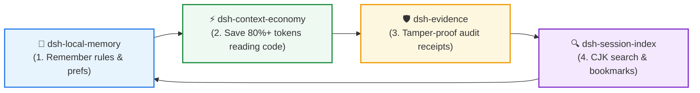

<div align="center">

# 🔍 dsh-session-index

**Full-text session search & bookmarking engine for DSH**  
*Native CJK Substring Search • Non-Blocking Worker Pool • Multi-Signal Ranking • Jump-Back Bookmarks*

[](https://github.com/huangjua)
[](#)
[](LICENSE)

[Features](#-key-features) • [Quick Start](#-quick-start) • [DSH Power Suite](#-dsh-power-suite) • [Tools](#-available-tools) • [Architecture](#-architecture) • [简体中文](README_zh.md)

</div>

---

### 💡 Why dsh-session-index?

DSH archives past conversations as compressed `.jsonl.zstd` event logs. Built-in search only supports exact whole-word Latin tokens, making Chinese searches return zero results, while full-pass decompression freezes the UI.

**`dsh-session-index` transforms dead logs into an instantly queryable second brain:**
- 🇨🇳 **Native CJK & Latin Substring FTS**: Engineered with FTS5 trigrams. The *only* implementation allowing Chinese substring & code fragment matching across historical turns.
- 🚀 **Non-Blocking Worker Pool**: Streaming decompression with multi-core workers. Keeps main-thread event loop lag strictly under `p95 < 23ms`.
- 🎯 **Multi-Signal Relevance Ranking**: Combines `fzy` fuzzy scoring, 21-day half-life recency decay, and workspace affinity (adapted from Atuin and McFly).
- 🔖 **Deterministic Bookmarking & Jump-Back**: Drop anchors at `(sessionId, messageId)` to quickly revisit past breakthroughs without modifying original archive files.

---

## 🚀 Quick Start

### Installation

```bash
# In your DSH plugin environment
dev_inject_plugin @dsh-external/dsh-session-index
```

### Typical Usage Flow

1. **Search with Chinese / Substring**: Run `session_index_search query="重构 认证中间件" mode="full"`.
2. **Review Relevance-Ranked Hits**: Inspect Codex-style snippet previews with exact message IDs.
3. **Drop a Bookmark**: Save critical moments via `session_index_bookmark action="add" label="JWT Auth Fix"`.

---

## 🧩 DSH Power Suite

This plugin is part of the **DSH Agent Power Suite** — 4 modular, zero-hard-dependency plugins forming a complete closed-loop developer workflow:



| Plugin | Role in Suite | Synergy with Session Index |
|---|---|---|
| 🔍 **[dsh-session-index](https://github.com/huangjua/dsh-session-index)** | **Session Search** (Current) | Provides high-speed CJK search and bookmarking across compressed session archives. |
| 🧠 **[dsh-local-memory](https://github.com/huangjua/dsh-local-memory)** | **Memory Layer** | Curates high-level memories. Memory curation belongs to local-memory; log search belongs here. |
| 🛡️ **[dsh-evidence](https://github.com/huangjua/dsh-evidence)** | **Audit & Receipts** | Allows searching past sessions to find past evidence bundles, audit logs, and claim anchors. |
| ⚡ **[dsh-context-economy](https://github.com/huangjua/dsh-context-economy)** | **Context Economy** | Compact pointer output generates 80%+ smaller session logs, reducing search index load. |

---

## 📖 Deep Dive & Reference

<details>
<summary><b>🛠️ Available Tools (5 Tools)</b></summary>

| Tool | Description |
|---|---|
| `session_index_status` | Inspect / refresh indexing state (active, progress, worker health, retention). |
| `session_index_list` | List sessions by workspace with stable cursor pagination or relevance sorting. |
| `session_index_search` | Search sessions in `mode=meta` or `mode=full` (FTS/Worker) with `role` and time filters. |
| `session_summary` | Generate deterministic summaries (timestamps, event breakdown, tool calls, optional LLM 1-liner). |
| `session_index_bookmark` | Add/list/remove bookmarks anchored at `(sessionId, messageId)` for instant jump-back. |

</details>

<details>
<summary><b>🏗️ Architecture & Non-Blocking Pipeline</b></summary>

```text
session_index_status / session_index_list / session_index_search / session_summary
        │
        ▼
SessionIndexBuilder (Singleton per root + indexFile)
 ├─ Single-flight Promise deduplication
 ├─ Durable run-marker: ~/.dsh/session-index/.tmp/build.lock
 ├─ Phase A (Head Pass): Stream-decompress first 10 records ➡️ quick index
 ├─ Phase B (Full Pass): Full event counts & assistant text ➡️ WorkerPool
 └─ Atomic Commit: Unique tmpfile ➡️ fsync ➡️ validate ➡️ rename
```

</details>

<details>
<summary><b>⚖️ Technical Trade-offs & Boundaries</b></summary>

| Advantage | Trade-off / Boundary |
|---|---|
| Unique CJK trigram search implementation | Couplings to DSH's compressed session storage format |
| Non-blocking worker pool (lag < 23ms) | Requires `node:sqlite` for FTS index |
| 214 test cases covering crash consistency & streaming | Dual index co-exists with official session query service |

</details>

<details>
<summary><b>🧪 Building & Testing</b></summary>

```bash
pnpm install --frozen-lockfile  # dependencies are pnpm-managed (peer deps: DSH 0.1.5-rc.1)
pnpm run check:dsh-contract     # Contract validation against the locked DSH runtime
pnpm run build                  # Build TypeScript to lib/
pnpm test                       # Run the test suite
```

**DSH compatibility.** The plugin targets DSH `0.1.5-rc.1` (session format v3) and reads
every durable generation it has seen on disk: legacy `session.jsonl.zstd` (v0/v1),
`session.v2.jsonl.zstd`, `session.v3.jsonl.zstd` and — since the 2026-10-01 v4 port —
`session.v4.jsonl.zstd` (DSH 0.2.0-rc.2). When a session directory holds
more than one generation (DSH keeps the pre-migration file), only the highest one is
indexed. v3 changed three load-bearing things the reader now models: the closed header
(`isSeeded` + `delegationDepth`), `system/message` as the fourth surface type (folded,
never indexed as text), and `{op:'replace',startSeq,endSeq}` replacements (v2 used
`start`/`end`). The v3 fixture under `test/fixtures/` is migrated from a real v0 log by
DSH's own restore path, not hand-written.

**Session v4 (2026-10-01).** Ported against the released `@deepseek-ai/dsh-session-format-v3-to-v4`
specification: the header gate accepts `version: 4` (same logical fields — the edge only
advances the version); `liftToolResult` promotes `tool/result` to a real tool role
(`role:'tool'`, message-level `toolCallId`, the wrapper's `content` lifted into
`message.content`), so replacement ops compare the lifted payload while v2/v3 keep the
wrapper comparison; `system/message` provenance became a direct kind
(`system-prompt` / `runtime-context`) instead of `{kind:'plugin', plugin:…}`;
`developer/message` joined the surface (`SURFACE_TYPES_V4`); `workspace/changes` joined the
modern log-only vocabulary. Regression: 321 real logs (v0=284 / v3=14 / v4=23) pass
`parseHead`, `parseFull` and `parseSearch` with zero failures.

**Installability.** The package declares `dsh.bundle.patch` (`./cordis.patch.yml`) so the
DSH plugin installer accepts it as a bundle, and its DSH peers read
`>=0.1.7-rc.1 <0.3.0` — the client evaluates them with
`semver.satisfies(runtime, range, { includePrerelease: true })`, which both `0.1.7-rc.1`
and `0.2.0-rc.2` satisfy.

</details>

<details>
<summary><b>🙏 Credits & Prior Art</b></summary>

- **OpenAI Codex** (`commit 9ded177`): Non-blocking v2 architecture, snippet previews, `HEAD_RECORD_LIMIT`.
- **jhawthorn/fzy**: `fzyScore` TypeScript translation (consecutive matching & bonus matrix).
- **Atuin & McFly**: Hit tiers × exponential time-decay scoring.
- **fzf**: Tie-break determinism algorithm.

</details>

---

<div align="center">
<sub>Part of the <a href="https://github.com/huangjua">DSH Agent Power Suite</a>. Licensed under BSD-3-Clause.</sub>
</div>
