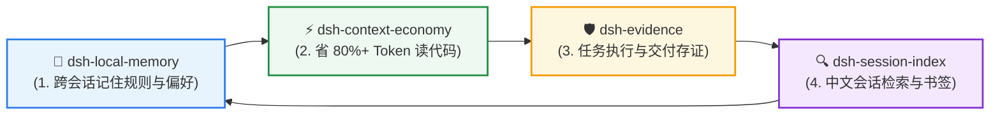

<div align="center">

# 🔍 dsh-session-index

**DSH 历史会话搜索引擎与书签工具**  
*原生 CJK 中文子串检索 • 多线程 Worker 非阻塞解压 • 多源相关性排序 • 精准锚点书签*

[](https://github.com/huangjua)
[](#)
[](LICENSE)

[核心亮点](#-为什么需要专门的会话检索) • [快速上手](#-快速上手) • [DSH 效率套件](#-dsh-agent-效率套件) • [工具列表](#-深度参考与架构) • [English](README.md)

</div>

---

### 💡 为什么需要专门的会话检索？

DSH 将历史对话压缩为 `.jsonl.zstd` 事件日志。官方自带的检索只支持拉丁整词匹配，导致中文关键词零命中，且全量解压会严重卡死主界面。

**`dsh-session-index` 将沉睡的压缩日志转化为随时可调用的“第二大脑”：**
- 🇨🇳 **原生支持中文 CJK 子串检索**：基于 FTS5 Trigram 分词，唯一支持中文短句、代码片段模糊召回。
- 🚀 **Worker 池多线程非阻塞构建**：多核流式解压，构建期间主线程事件循环延迟严格保持在 `p95 < 23ms`，丝毫不卡顿编码。
- 🎯 **多源融合相关性排序**：结合 `fzy` 模糊打分 + 21天时间指数衰减 + 工作区亲缘度，优先召回最相关的关键对话。
- 🔖 **确定性锚点书签与跳回**：为 `(sessionId, messageId)` 打书签，随时无损跳转回当时会话上下文。

---

## 🚀 快速上手

### 安装

```bash
# 在 DSH 插件环境中注入
dev_inject_plugin @dsh-external/dsh-session-index
```

### 典型使用

1. **中文检索**：`session_index_search query="重构 认证中间件" mode="full"`
2. **查看摘要**：`session_summary sessionId="session-xxxx"`
3. **添加高光书签**：`session_index_bookmark action="add" label="修复 JWT 鉴权漏洞"`

---

## 🧩 DSH Agent 效率套件

本插件是 **DSH Agent 开发者效率套件** 的核心成员 —— 4 个插件无硬依赖，组合使用实现完整工程闭环：



| 插件 | 套件定位 | 与会话检索层的协作 |
|---|---|---|
| 🔍 **[dsh-session-index](https://github.com/huangjua/dsh-session-index)** | **会话历史检索** (当前) | 负责海量压缩日志的流式解压、中文子串搜索与历史跳回。 |
| 🧠 **[dsh-local-memory](https://github.com/huangjua/dsh-local-memory)** | **本地记忆层** | 负责提炼后的长期记忆。提炼记忆找 local-memory，原始对话日志找本插件。 |
| 🛡️ **[dsh-evidence](https://github.com/huangjua/dsh-evidence)** | **审计存证层** | 通过本插件可秒级搜出历史任务中生成的 Evidence 证据包与审计结论。 |
| ⚡ **[dsh-context-economy](https://github.com/huangjua/dsh-context-economy)** | **上下文经济层** | 精简的指针输出使会话日志体积减少 80%+，大幅减轻解压与索引开销。 |

---

## 📖 深度参考与架构

<details>
<summary><b>🛠️ 5 个 session_index_* 工具列表</b></summary>

| 工具 | 作用 |
|---|---|
| `session_index_status` | 查看/刷新索引状态（进度、健康度、保留策略） |
| `session_index_list` | 按工作区列出历史会话（支持 Cursor 稳定分页或相关性排序） |
| `session_index_search` | 搜索历史会话（支持 `mode=meta` 或 `mode=full`，带角色与时间过滤） |
| `session_summary` | 生成单个会话的确定性结构化摘要（含事件统计与工具调用） |
| `session_index_bookmark` | 锚定 `(sessionId, messageId)` 添加/列出/删除高光书签并跳回 |

</details>

<details>
<summary><b>🏗️ 非阻塞流水线架构</b></summary>

```text
session_index_status / session_index_list / session_index_search / session_summary
        │
        ▼
SessionIndexBuilder (单例)
 ├─ Single-flight Promise 并发去重
 ├─ Phase A (Head Pass): 变更文件流式解压前 10 条 ➡️ 快速提交 quick index
 ├─ Phase B (Full Pass): 提取正文与工具计数 ➡️ WorkerPool 并行解析
 └─ 原子提交: 唯一 tmpfile ➡️ fsync ➡️ 校验 ➡️ rename
```

</details>

<details>
<summary><b>⚖️ 优点与权衡边界</b></summary>

| 优点 | 权衡 / 边界 |
|---|---|
| 唯一支持 CJK 中文子串检索的实现 | 强耦合 DSH 内部压缩存储格式 |
| Worker 池流式解压，主线程零卡顿 | 依赖 `node:sqlite` |
| 214 项测试全面覆盖崩溃安全与流解析 | 派生索引与官方 session-query-sqlite 独立并存 |

</details>

<details>
<summary><b>🧪 构建与测试</b></summary>

```bash
pnpm install --frozen-lockfile  # 依赖全部由 pnpm 管理（peer 依赖：DSH 0.1.5-rc.1）
pnpm run check:dsh-contract     # 校验依赖契约
pnpm run build                  # 编译 src → lib
pnpm test                       # 运行全部测试用例
```

**DSH 兼容性。** 插件目标运行时为 DSH `0.1.5-rc.1`（会话格式 v3），同时读取磁盘上出现过的
全部代际：遗留 `session.jsonl.zstd`（v0/v1）、`session.v2.jsonl.zstd`、`session.v3.jsonl.zstd`。
同一会话目录里旧代际文件不会被 DSH 删除，索引只收最高代际，避免同一会话重复出现。
v3 的三处关键差异都已在读取器中建模：闭合 header（`isSeeded` + `delegationDepth`）、
`system/message` 作为第四种 surface 类型（参与折叠、不参与正文索引）、
`{op:'replace',startSeq,endSeq}` 替换编码（v2 为 `start`/`end`）。
`test/fixtures/` 下的 v3 夹具由真实 v0 日志经 DSH 自带迁移链生成，非手写形状。

</details>

<details>
<summary><b>🙏 借鉴与致谢</b></summary>

- **OpenAI Codex** (`commit 9ded177`): 非阻塞 v2 架构、代码片段截断、`HEAD_RECORD_LIMIT`。
- **jhawthorn/fzy**: `fzyScore` 纯 TS 直译与奖励矩阵。
- **Atuin & McFly**: 命中档位 × 时间衰减打分算法。
- **fzf**: 决序 tiebreak 算法。

</details>

---

<div align="center">
<sub>属于 <a href="https://github.com/huangjua">DSH Agent 开发者效率套件</a> • 采用 BSD-3-Clause 开源协议</sub>
</div>
