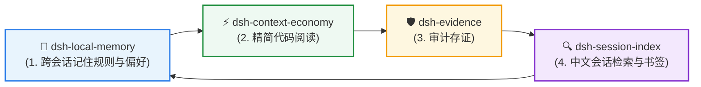

<div align="center">

# 🔍 dsh-session-index

**DSH 历史会话搜索引擎与书签工具**  
*CJK 中文子串检索 • Worker 索引构建 • 多源相关性排序 • 稳定消息锚点*

[](https://github.com/huangjua)
[](#)
[](LICENSE)

[核心亮点](#-为什么需要专门的会话检索) • [快速上手](#-快速上手) • [DSH 效率套件](#-dsh-agent-效率套件) • [深度参考](#-深度参考与架构) • [English](README.md)

</div>

---

### 💡 为什么需要专门的会话检索？

DSH 将持久会话历史压缩为 `.jsonl.zstd` 事件日志。本插件独立构建元数据与全文索引，便于检索历史中文短句、代码片段，不修改原日志。

- 🇨🇳 **中文与拉丁文字子串检索**：FTS5 Trigram 召回候选，再用完整原消息验证，短词走 LIKE。
- 🚀 **Worker 索引构建**：解析 Worker 流式解压，独立的 SQLite writer 与 WAL reader 子进程将同步 SQL 移出宿主事件循环。实测与资源边界见下文。
- 🎯 **多源相关性排序**：结合 `fzy` 模糊打分、21 天半衰期的时间衰减与工作区亲缘度，借鉴 Atuin 和 McFly。
- 🔖 **稳定消息书签**：新书签使用 `(sessionId, anchorId)`，在支持的身份契约内重建仍能定位，锚点缺失或被替换时明确失败。

---

## 🚀 快速上手

### 安装与部署

包入口为 `lib/index.js`；`package.json` 的 `dsh.bundle.patch` 与 `cordis.patch.yml` 供 DSH 以 bundle 方式安装，通过 profile 的 `dsh.profile.bundles` 选中，或走 DSH 的 `dsh plugin add` 流程。加载前需编译完整 `lib/`，包含 Worker 模块。

本工作树的 **`0.0.3-rc.2` 是隔离运行修复候选**，产物目录为 `release/RUNTIME-20261002/`。验证与部署步骤见 [RUNTIME_FIX_REPORT.txt](RUNTIME_FIX_REPORT.txt) 和 [DEPLOYMENT_AND_ROLLBACK.txt](DEPLOYMENT_AND_ROLLBACK.txt)。生产部署另行批准。在隔离 E 盘工作区编译；G 盘源码比已部署运行产物旧，禁止直接 build。候选根目录 `cordis.patch.yml` 是通用配置，不得替换现有用户配置。

### 典型使用

以下是工具调用示意，会话与锚点应使用正文搜索返回的实际配对。

```text
session_index_search query="重构 认证中间件" mode="full"
session_summary id="session-xxxx"
session_index_bookmark action="add" sessionId="session-xxxx" anchorId="a1:..." label="JWT Auth Fix"
session_index_bookmark action="list" query="JWT"
session_index_search session_id="session-xxxx" anchor_id="a1:..." window=5
```

`session_summary` 使用 **`id`**，bookmark add 使用 **`sessionId`** 与 **`anchorId`**，SCROLL 使用 **`session_id`** 与 **`anchor_id`**。省略消息锚点创建会话级书签，纯元数据命中没有消息锚点。

---

## 🧩 DSH Agent 效率套件

本插件属于 **DSH Agent 开发者效率套件**，四个模块彼此没有硬依赖：



| 插件 | 定位 | 与会话索引的协作 |
|---|---|---|
| 🔍 **[dsh-session-index](https://github.com/huangjua/dsh-session-index)** | 会话检索 | 搜索压缩历史并保存书签。 |
| 🧠 **[dsh-local-memory](https://github.com/huangjua/dsh-local-memory)** | 记忆层 | 提炼高层记忆，本插件检索原日志。 |
| 🛡️ **[dsh-evidence](https://github.com/huangjua/dsh-evidence)** | 审计存证 | 会话检索帮助定位先前的证据包与审计结论。 |
| ⚡ **[dsh-context-economy](https://github.com/huangjua/dsh-context-economy)** | 上下文经济层 | 精简指针输出可降低日志体积和索引工作量。 |

---

## 📖 深度参考与架构

<details>
<summary><b>🛠️ 五个工具</b></summary>

| 工具 | 作用 |
|---|---|
| `session_index_status` | 查看/刷新元数据与 FTS 状态、解析和已提交 checkpoint、扫描完整性、Worker 健康与保留策略。 |
| `session_index_list` | 按工作区列出会话，支持 Cursor 稳定分页或相关性排序。 |
| `session_index_search` | 搜索元数据（默认 `mode=meta`）或正文（`mode=full`）；SCROLL 查看精确会话/消息锚点周围的上下文。 |
| `session_summary` | 确定性字段、时间、事件和工具计数，可附加缓存的 LLM 一句话摘要；必填参数为 `id`。 |
| `session_index_bookmark` | 添加/列出/删除书签，`add` 必填 `sessionId`，消息书签使用 `anchorId`。 |

可选 LLM 摘要由 `llmSummaryEnabled` 控制（默认 `true`），仅在摘要路径运行，不可用时回退确定性输出。设为 `false` 可关闭 provider 调用和摘要缓存访问。

</details>

<details>
<summary><b>🔎 正文覆盖与过滤</b></summary>

`mode=full` 按支持的 surface replacement 规则折叠后检索 user/assistant 文本和 `tool/call` 工具名，不检索 system/developer 消息、工具结果正文、工具参数或非文本内容。tool 角色命中代表工具名，不代表输出。不限定消息角色时，full 也可能返回纯元数据命中，其 `kind=meta` 条目没有锚点。

FTS 在每来源 **50,000 条消息 / 64 MiB UTF-8 文本**收集预算内保存完整原消息。检索块为 **4096 个 UTF-16 代码单元、重叠 128 单元**，不破坏代理对。候选先归并为原消息，用完整文本验证，每会话选择最佳消息后再应用会话上限。短词与超过重叠长度的词走原文路径。多词要求全部出现在**同一条原消息**；只有 FTS 和原文搜索合计没有正文 AND 命中时，full 才放宽为 OR。不同消息里的词不会合并为 AND 命中。

原日志回退在相同兼容门禁下覆盖不完整/dirty 索引及不可用 FTS。默认每来源**单条 JSONL 4 MiB / 总解压 256 MiB**。大行可使用 `session_index_search ... maxLineBytes=33554432` 提高原文补查行预算至 32 MiB，接受 4..32 MiB 范围内的整数字节值，总解压仍限 256 MiB。临时补查不重写索引，也不接受未知 required event。

| 过滤参数 | 实际粒度 |
|---|---|
| `workspace` | 会话工作区的大小写不敏感子串。 |
| full 的 `filter.role` | `user`、`assistant`、`tool`、`any`，在计数与截断前应用；指定角色时排除纯元数据命中。 |
| meta 的 `filter.role` | `tool` 近似筛选有工具调用的会话，`user`/`assistant` 不提供消息级过滤。 |
| `filter.sinceMs` / `filter.untilMs` | **会话 `lastTime`** 闭区间，epoch 毫秒；不是单条消息时间。 |

来源发现最多 10,000 个会话文件，元数据/原文候选窗口最多 2,000 个会话，FTS 排序窗口最多 500 个会话候选。lineage 将相关分支分组，代表的实际会话/文件/锚点保持同源。将 `total` 当作完整总数前应检查 `totalExact`、`hasMore`、`truncated` 与 `coverage`。来源失败在 `coverage.diagnostics` 中说明预算和原因，最多 20 条并标记诊断截断，覆盖不完整时零命中不能证明不存在。

</details>

<details>
<summary><b>🔖 锚点、旧书签与迁移</b></summary>

原始 message/call ID 锚点（`a1:`）使用会话/类型命名空间，支持的 v0–v4 夹具验证跨代际身份保留。无原始 ID 时使用代际/seq/完整正文证据绑定的 fallback（`a1s:`），相同来源表示重建可保留，但不保证跨格式迁移或替换稳定。

SCROLL 验证 `(session_id, anchor_id)`，分别返回**该会话内的原消息**前后最多 `window` 条（`window=1..20`，默认 5）。chunk 和全局行号距离不是导航单位。过期、缺失、歧义会话/锚点明确返回，不用邻近消息冒充。SCROLL 需要可用 FTS，原文回退的锚点在入库前可能无法跳回。

旧 `message_id` SCROLL 只读取既存 legacy SQLite rowid，不重新解释为事件 seq，也不是新锚点行的数字别名。书签 `messageId` 仍可读，但数字本身不能证明位置。新消息书签应使用搜索返回的实际 `sessionId`/`anchorId`。

书签是用户数据，存在独立于可重建 `fts.db` 的 `bookmarks.jsonl` 中，v2 读取器兼读 v1。`migrateBookmarks` 是显式操作，默认 dry-run，search/list 不迁移。转换需要已持久化的稳定锚点和身份依据。未解、歧义、会话缺失、锚点已替换条目保留旧字段及诊断。生产迁移需要备份并停止或升级所有共享 dataDir 写入方。回滚必须保留部署后新增的书签。

</details>

<details>
<summary><b>🏗️ 架构与恢复</b></summary>

```text
工具 → SessionIndexBuilder（每 root/indexFile 单飞）
        ├─ Head pass：前 10 条记录 → quick 元数据索引
        ├─ Full/delta parser workers → 来源顺序原消息
        ├─ FtsClient → 有界传输 → 磁盘 spool
        │              ├─ SQLite writer：消息/chunk/元数据/checkpoint 同一事务
        │              └─ 只读 WAL reader：同一快照内查询
        └─ index.json → 唯一临时文件 → fsync → 校验 → rename
```

解析和 FTS 已提交进度分开，SQL 失败不前移已提交 checkpoint，事务失败保留此前可搜索快照。启动和 watcher 回退按指纹与 dirty checkpoint 对账，扫描不完整不能确认删除。delta 解压实际从校验 offset 读取压缩尾段，校验 source race 和帧边界。

FTS 单包最多 **512 KiB**、**在飞最多 2 包**、**传输/排队 producer 预算 8 MiB**、**活跃来源最多 2 个**，每活跃来源另有 64 MiB 正文预算。这些不是 RSS 上限，文本对象、解析缓冲与 SQLite 均增加内存。每条 SQLite 连接使用独立子进程，原生同步 SQL 可在有界期限内终止。reader 故障仅恢复 reader，保留 writer 事务与 checkpoint；排队期限到期不会重启健康通道。

默认 query **10 秒贯穿 ready、恢复、排队与执行**，write 120 秒，进程握手/close drain 15 秒，迁移总期限 90 秒、锁等待 60 秒、无进展 20 秒。启动公开 booted/opening/migrating/ready/failed 状态与真实批次进度，完整检查和重型维护独立于普通启动。长写入时 health 返回带 `observedAt`、`healthBusy` 的快照。当前恢复健康后仍保留历史错误与恢复次数。

公开搜索结果记录实际 backend 与工具耗时。请求诊断分解排队、SQL、序列化、恢复与传输估计，不保存查询词或正文。`transportMs` 是明确标注的余量；`dispatchMs` 包含 SQL，不能相加。delta 回退保留解析器明确原因、累计实际读量、attempt 与最终 checkpoint 一致性；无法追溯的历史原因保留 `unknown`。

`dataDir` 默认 `$DSH_HOME/session-index`，存放 `index.json`、`fts.db`、`bookmarks.jsonl` 和可选 `llm-summary.jsonl`，`sessionsRoot`/`indexFile` 可配置。`ftsEnabled=false` 跳过 SQLite，使用有界原文搜索，SCROLL 不可用。保留策略默认 90 天（`0` 关闭），只移除派生条目，不删除原日志或书签；FTS 不可用时跳过维护。

</details>

<details>
<summary><b>🧪 兼容版本、验证与实测</b></summary>

锁定构建/契约目标为 **DSH `0.2.0-rc.2`**、Cordis `4.0.4`、Schemastery `3.18.4`。DSH peer 声明 `>=0.1.7-rc.1 <0.3.0`，安装范围不代表逐个版本已实测。编译使用 **Node `v24.16.0`**；运行修复验收使用已安装的 **Electron 44 / Node `v24.18.1` / SQLite `3.53.1`**。FTS 需要独立进程内可用 `node:sqlite`/FTS5，SQLite 不可用时记录实际原文回退。

读取器支持遗留 `session.jsonl.zstd`（v0/v1）、`session.v2.jsonl.zstd`、`session.v3.jsonl.zstd`、`session.v4.jsonl.zstd`，每目录只选最高代际。v3 建模 `isSeeded`/`delegationDepth`、system 折叠、`startSeq`/`endSeq` 替换；v4 建模提升后工具结果、直接 system provenance、developer 消息和 `workspace/changes`，折叠不代表被排除的正文可检索。未知 required event 仍被门禁拒绝。2026-10-01 历史证据为 321 个真实日志（v0=284/v3=14/v4=23）通过 head/full/search 解析，不是本轮测试数量。

隔离工作树直接使用锁定编译器：

```text
node node_modules/typescript/bin/tsc -p tsconfig.json --noEmit
node scripts/check-dsh-contract.mjs
node node_modules/typescript/bin/tsc -p tsconfig.test.json
node scripts/run-isolated-tests.mjs <新label> <受影响test文件basename...>
```

隔离 runner 将 `DSH_HOME`、dataDir/会话夹具和临时目录设到测试自有路径。按 diff 选测试，保留失败/重跑日志；基准和测试分开运行。候选使用锁定编译器与 runbook 流程编译，以免重链接依赖；`scripts/build.sh` 在 `DSH_CHECKOUT` 选中完整宿主 checkout 时可重新链接依赖。

S5 夹具测量使用 20 个独立进程（baseline/candidate × cold/steady × 5）。五轮 candidate steady 最大事件循环 gap 为 **31.949 ms**，达到夹具的 100 ms 目标，baseline steady 各轮最大值范围 **418.591–1529.072 ms**。更完整 schema 写入更慢（candidate 1.366–2.773 秒，baseline 0.669–1.524 秒）。这些宿主/夹具测量不保证固定 UI 延迟。50,000 消息压力夹具并发 reader 查询不超过 133.792 ms，结束 RSS 约 257 MB，不是实测峰值。另一个 delta 实验在 1/16/64 MiB 前缀后，15 次读取/输入分配均为同样的 32 字节尾段。

原始输出、哈希、迁移计数和最终检查见 [HANDOFF_S3_S5.txt](HANDOFF_S3_S5.txt)、[BENCHMARK_RESULTS/S3-S5_PERFORMANCE.json](BENCHMARK_RESULTS/S3-S5_PERFORMANCE.json)、[TEST_RESULTS/S3-S5_VALIDATION.json](TEST_RESULTS/S3-S5_VALIDATION.json)、[MIGRATION_DRY_RUN.json](MIGRATION_DRY_RUN.json) 和 [RELEASE_READINESS.txt](RELEASE_READINESS.txt)。合成迁移计数不代表生产书签的可恢复数量。

</details>

<details>
<summary><b>🙏 借鉴与致谢</b></summary>

- **OpenAI Codex**（`commit 9ded177`）：非阻塞 v2 架构、片段预览与 `HEAD_RECORD_LIMIT`。
- **jhawthorn/fzy**：`fzyScore` TypeScript 翻译与匹配奖励矩阵。
- **Atuin 与 McFly**：命中档位及时间衰减打分。
- **fzf**：确定性的并列排序规则。

</details>

---

<div align="center">
<sub>属于 <a href="https://github.com/huangjua">DSH Agent 开发者效率套件</a> • 采用 BSD-3-Clause 开源协议</sub>
</div>
